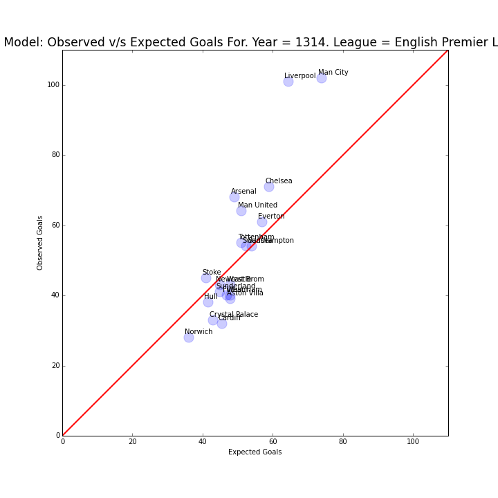
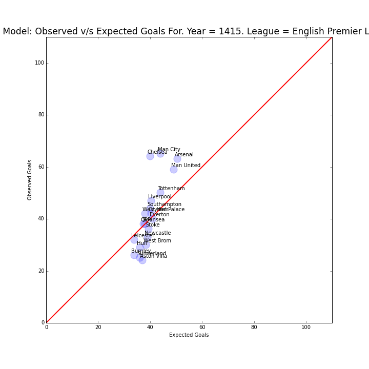
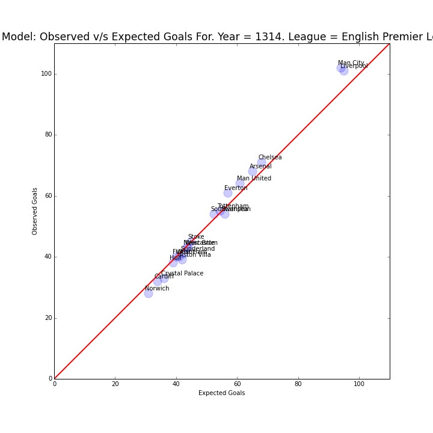
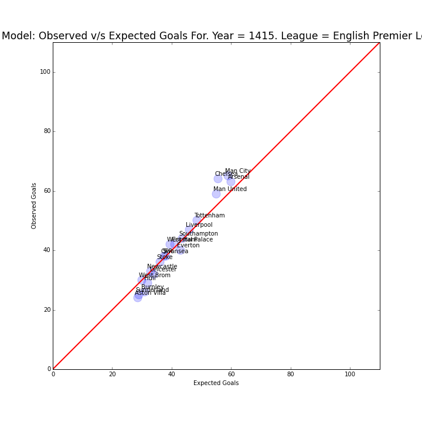

### [Biao - Blangiardo Model](http://nbviewer.ipython.org/github/akhilketkar/am207-project-soccer/blob/master/biao_blangiardo_model.ipynb)
This model has serious issues with regards to shrinking the observations to the mean.

#### 2013-14 EPL Data 

#### 2014-15 EPL Data

### [Biao - Blangiardo Model modified by DW](http://nbviewer.ipython.org/github/akhilketkar/am207-project-soccer/blob/master/daniel_weitzenfeld_variation_bb_model.ipynb)
This model does much better.

#### 2013-14 EPL Data 

#### 2014-15 EPL Data

