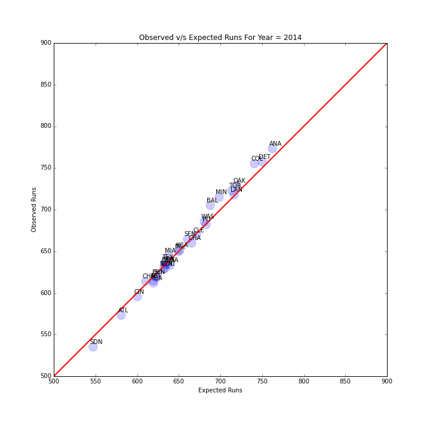
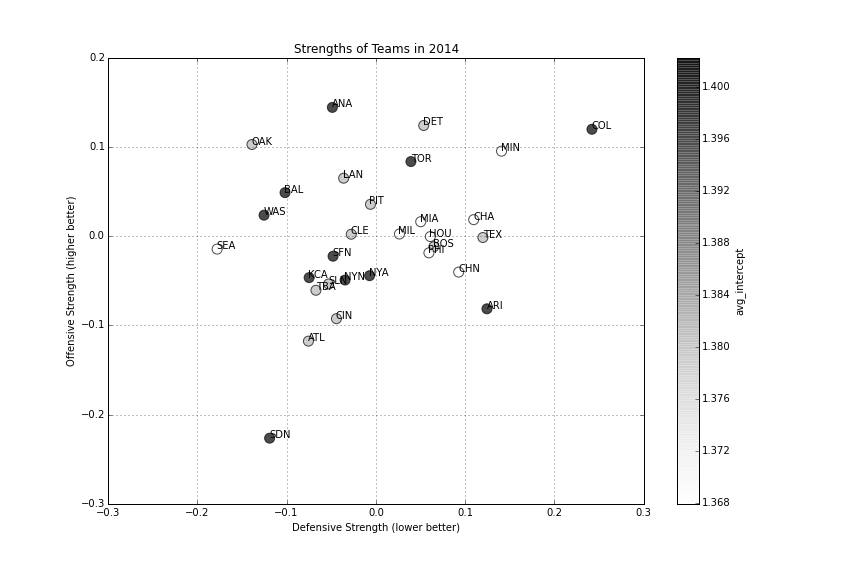

### Baseball Model
We applied the model developed for soccer to baseball. The mehtodology is the same and is described in detail [here](http://nbviewer.ipython.org/github/akhilketkar/am207-project-soccer/blob/master/baseball_model.ipynb). Runs scored by each team are treated as a Poisson process. They are the equivalent of goals in the model for soccer. 

#### 2014 MLB Data

