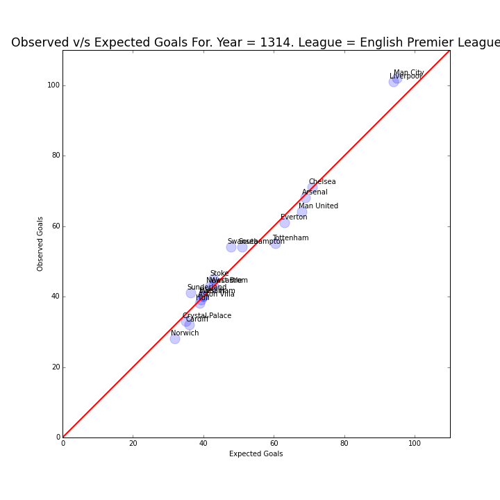
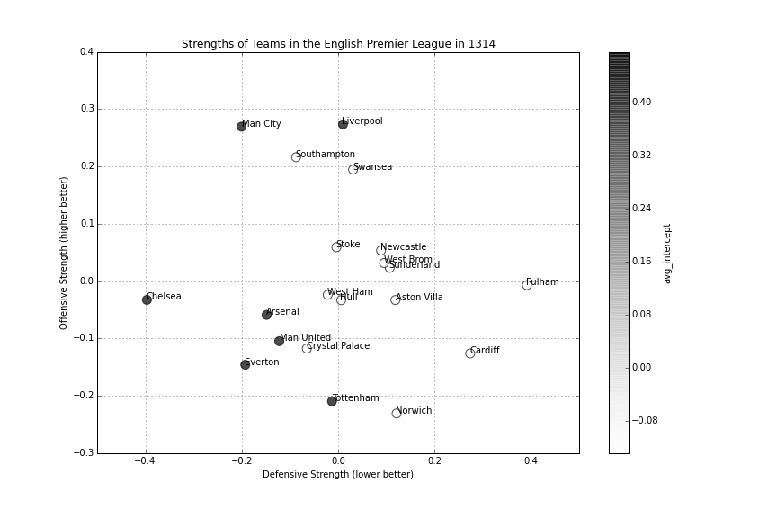
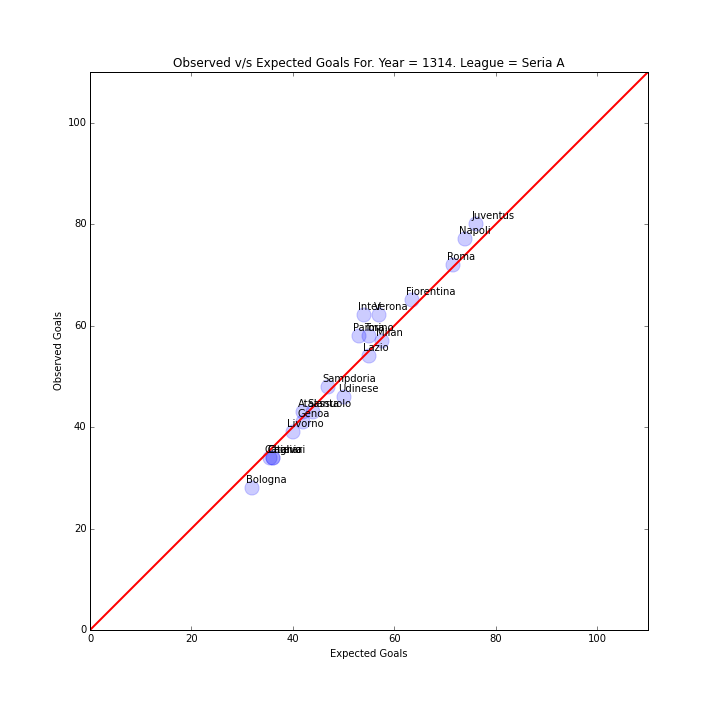
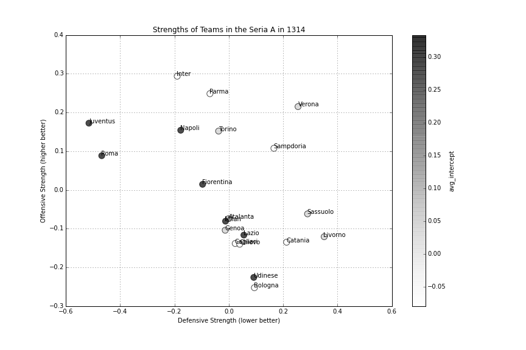
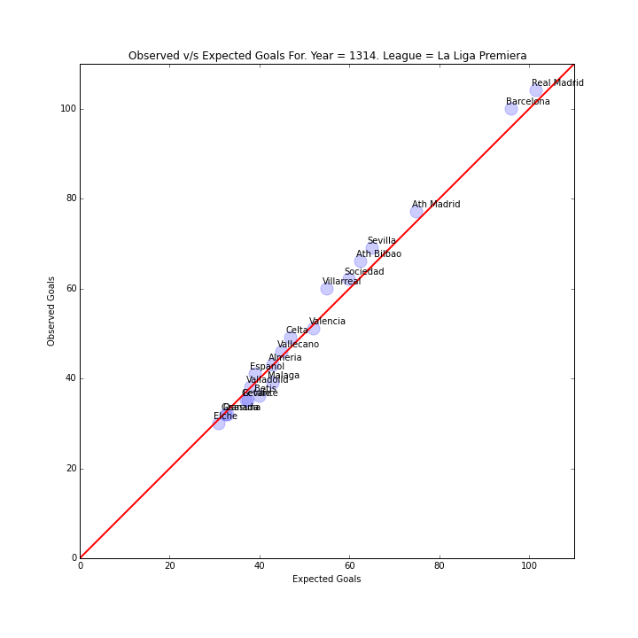
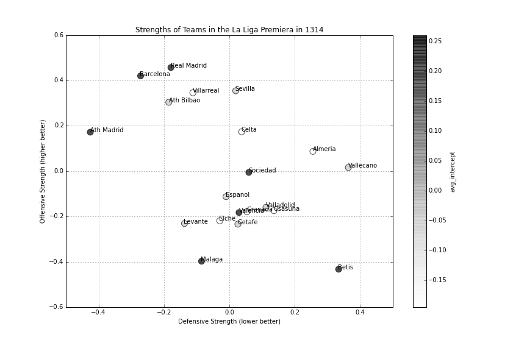

### Modified Biao Blangiardo Model
The model is described in detail [here](http://nbviewer.ipython.org/github/akhilketkar/am207-project-soccer/blob/master/daniel_weitzenfeld_variation_bb_model_ak_updates.ipynb)

It basically tries to address the issue of shrinkage by allowing more parameters to vary between the weak and strong teams. The model seems to fit the data quite well. Here are some examples

#### 2013-14 EPL Data

#### 2013-14 Italian Seria A Data

#### 2013-14 La Liga Data

