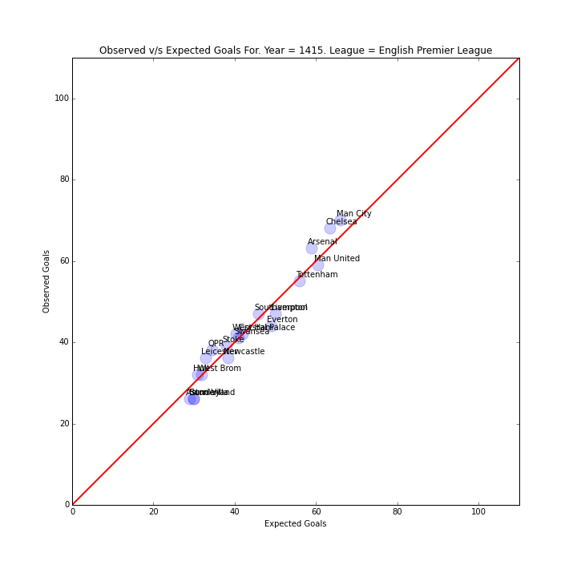
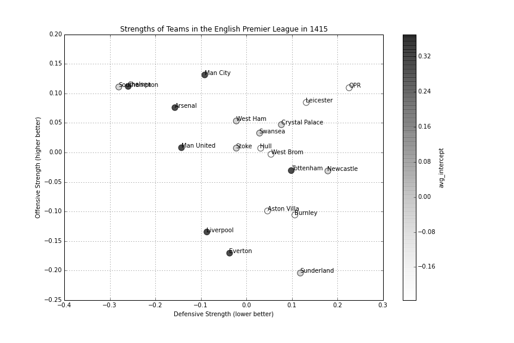

### Predicting Games for the Week of 4/18
We do this by fitting our [model](http://nbviewer.ipython.org/github/akhilketkar/am207-project-soccer/blob/master/daniel_weitzenfeld_variation_bb_model_ak_updates.ipynb) to the all the data from the previous weeks of the season. 

### Predictions

| home           | away        | p_home_win | p_away_win | p_draw | mean_home_goals | mean_away_goals | 
|----------------|-------------|------------|------------|--------|-----------------|-----------------| 
| Arsenal        | Sunderland  | 0.735      | 0.105      | 0.160  | 2.363           | 0.725           | 
| Aston Villa    | QPR         | 0.402      | 0.316      | 0.282  | 1.139           | 0.980           | 
| Chelsea        | Man United  | 0.516      | 0.257      | 0.227  | 1.792           | 1.182           | 
| Crystal Palace | West Brom   | 0.566      | 0.204      | 0.230  | 1.578           | 0.827           | 
| Everton        | Burnley     | 0.624      | 0.146      | 0.230  | 1.893           | 0.765           | 
| Hull           | Liverpool   | 0.275      | 0.468      | 0.257  | 0.992           | 1.407           | 
| Leicester      | Swansea     | 0.327      | 0.371      | 0.302  | 1.016           | 1.077           | 
| Man City       | West Ham    | 0.639      | 0.163      | 0.198  | 2.122           | 0.979           | 
| Newcastle      | Tottenham   | 0.316      | 0.446      | 0.238  | 1.315           | 1.583           | 
| Stoke          | Southampton | 0.317      | 0.387      | 0.296  | 0.899           | 1.023           | 

CSV to markdown converter thanks to [Donat Studios](https://donatstudios.com/CsvToMarkdownTable)
